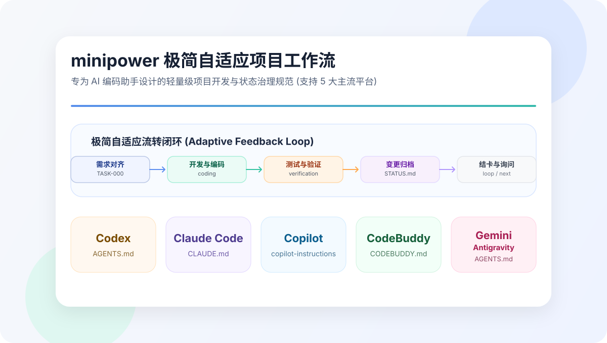

<p align="right"><strong>EN</strong> | <a href="./README.zh-CN.md">简体中文</a></p>

# Agent Workflow Skill Generator

<p align="center">
  
</p>

An interactive installer that initializes the **minipower** minimalist project-workflow for AI coding agents. 

Run one script to instantly set up lightweight project governance files in your current repository root, and optionally install the universal `minipower` capability skill globally.

## Why minipower?

- **Zero-Overhead by Default**: No task cards are required for trivial edits or single-line fixes. Modify the codebase directly, run tests, archive the change, and carry on.
- **On-Demand Task Cards**: For complex tasks, the Agent automatically reads a local template (`specs/TASK-card.md`) and writes custom execution cards (`specs/TASK-xxx.md`) directly in the workspace.
- **Session Continuation**: Instructs the Agent to inspect `STATUS.md` on startup, automatically restore active task contexts, and report progress, avoiding "memory resets" when switching chat sessions or agents.
- **Test-Fail-Fix Feedback Loop**: Enforces an inner developer loop (write code -> run tests -> if failed, fix and retest -> if passed, archive) to keep your project green.

## Initialized Files (Workspace)

When running the installer in your project root, it initializes the following files:
- **专属配置文件** (e.g. `CLAUDE.md`, `AGENTS.md`, `.github/copilot-instructions.md`, or `CODEBUDDY.md` depending on your host): Persists the structured workflow defaults. Supports appending or overwriting rules.
- `STATUS.md`: The single source of truth for tracking current status, goals, next actions, and the modification log (`Change Log`).
- `specs/TASK-000.md`: A template for brainstorming and requirements alignment.
- `specs/TASK-card.md`: A template for standard development task cards.

## Supported Hosts (Global Skills)

You can copy the universal `minipower` capability skill globally to any of the following hosts:
- **Claude Code** (`~/.claude/skills/`)
- **GitHub Copilot** (`~/.copilot/skills/`)
- **Codex** (`~/.codex/skills/`)
- **CodeBuddy** (`~/.codebuddy/skills/`)

## Quick Start

Run this one-liner in your target project directory to start the interactive initialization:

```bash
curl -fsSL https://raw.githubusercontent.com/WanGXUUvU/OneMore_vibe-coding/main/install.sh | bash
```

Or clone and run manually:

```bash
git clone --depth 1 https://github.com/WanGXUUvU/OneMore_vibe-coding.git && cd OneMore_vibe-coding && ./generate.sh
```
